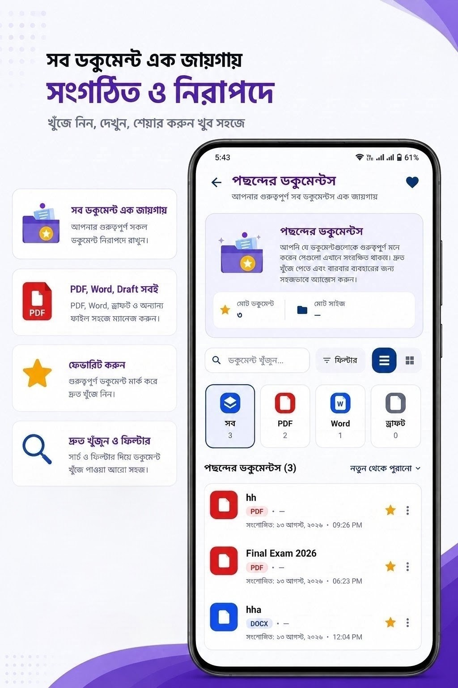
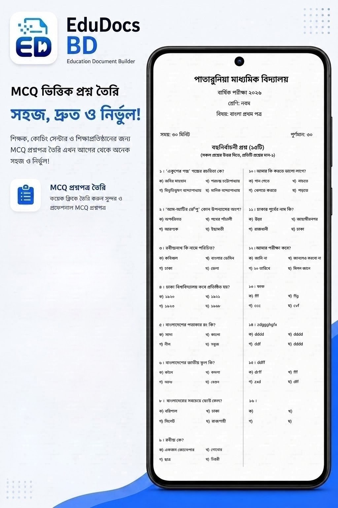
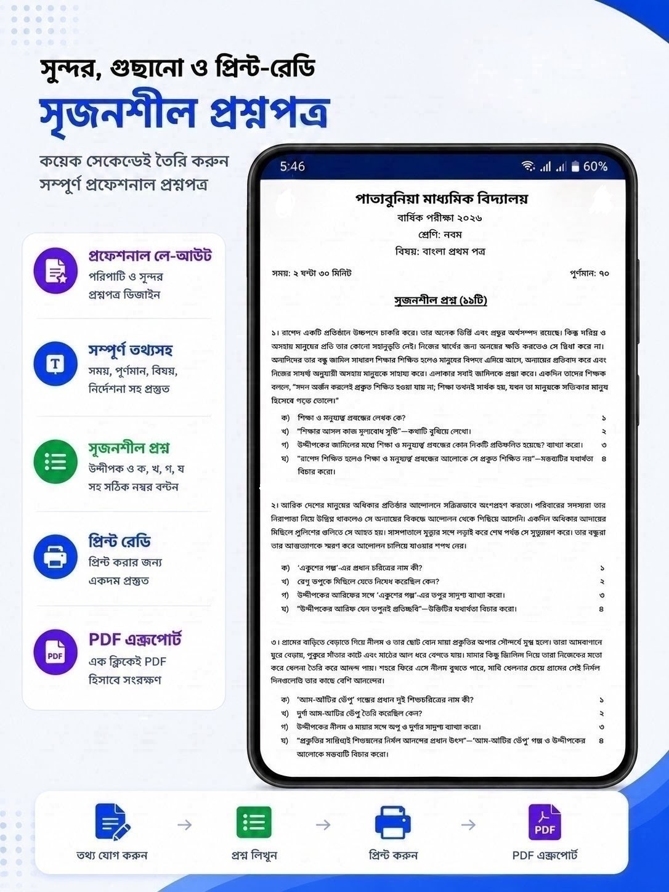
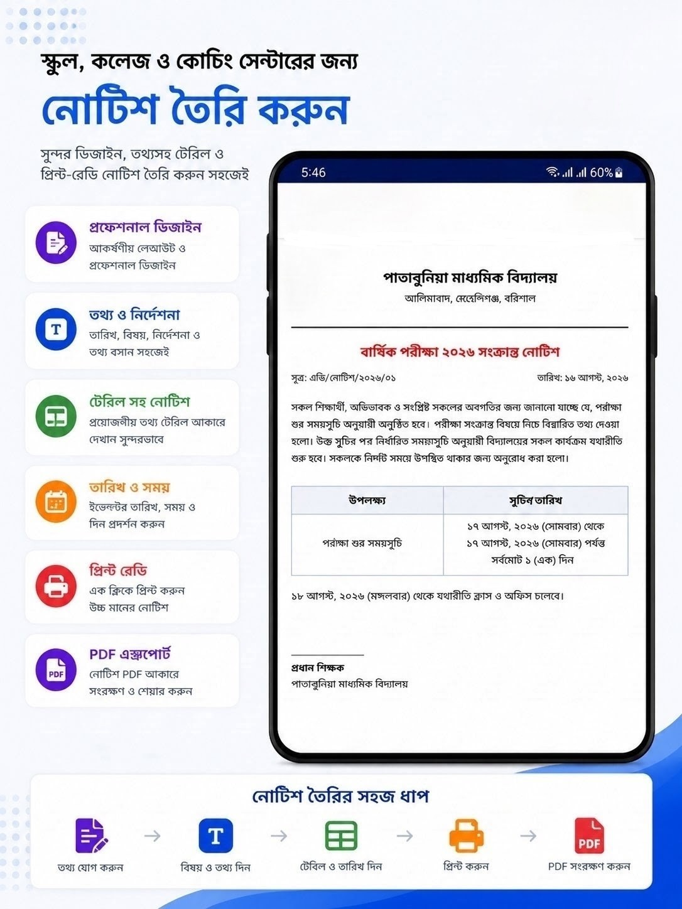
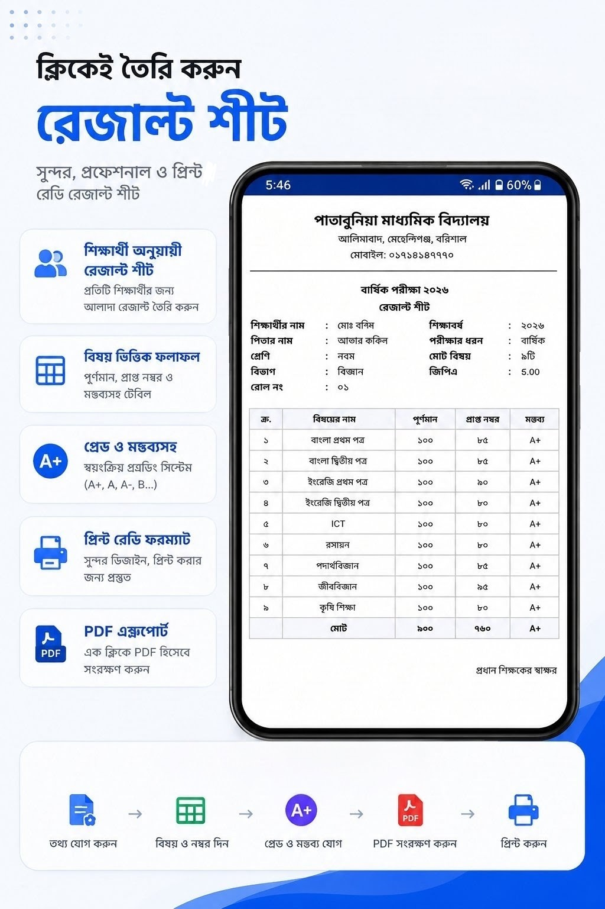

# 📱 EduDocs BD – Document Maker

EduDocs BD All-in-One Educational Document Maker for Bangladesh is an Android application designed for teachers, coaching centers, private tutors, schools, colleges, madrasahs, and educational institutions. It helps educators create professional educational documents quickly from a single mobile application.

## 📱 App Screenshot

<table>
  <tr>
    <td align="center">
      <b>Home Screen</b> 
      
    </td>
    <td align="center">
      <b>My Documents</b> 
      
    </td>
  </tr>

  <tr>
    <td align="center">
      <b>Favorites</b> 
      
    </td>
    <td align="center">
      <b>MCQ Question Paper</b> 
      
    </td>
  </tr>

  <tr>
    <td align="center">
      <b>Creative Question (CQ)</b> 
      
    </td>
    <td align="center">
      <b>Question Paper Workflow</b> 
      
    </td>
  </tr>

  <tr>
    <td align="center">
      <b>Notice Maker</b> 
      
    </td>
    <td align="center">
      <b>Result Sheet</b> 
      
    </td>
  </tr>

  <tr>
    <td align="center">
      <b>Backup & Restore</b> 
      
    </td>
    <td align="center">
      <b>Exam Routine</b> 
      
    </td>
  </tr>
</table>

## ✨ Features

### 📝 Question Paper Maker

Create question papers for different classes, subjects, and examinations.

* CQ (Creative Questions)
* MCQ (Multiple Choice Questions)
* English Question Papers
* SSC examinations
* HSC examinations
* Primary examinations
* Class 8 Scholarship examinations
* School examinations
* Coaching center examinations
* Class tests and assessments

---

### 📢 Notice Maker

Create professional educational notices using convenient templates.

* General Notices
* Exam Notices
* Fee Notices
* Holiday Notices
* Admission Notices
* Parents' Meeting Notices
* Result Announcements
* Important Educational Announcements

---

### 📅 Exam & Class Routine Maker

Create organized academic schedules for schools, coaching centers, teachers, and educational institutions.

* Exam Routine
* Class Routine
* Subject & Schedule Management
* Organized printable layouts

---

### 📊 Result Sheet Maker

Create student result sheets quickly and efficiently.

* Individual Student Results
* Class Results
* Subject-wise Marks
* Grade & GPA Calculation
* Professional Result Formats

---

### 🎫 Admit Card Maker

Create student admit cards for:

* Schools
* Coaching Centers
* Private Educators
* Educational Institutions

---

### 🏆 Certificate Maker

Create certificates for different academic and educational purposes.

---

### 📚 Assignment & Homework Maker

Prepare structured educational materials for students.

* Assignment Sheets
* Homework Sheets
* Printable layouts

---

### 📄 Application Letter Maker

Create educational applications and request letters using ready-to-use templates.

---

## 🛠️ Technology:
* Java 
* XML
* Room Database
* Material Design

---

## 📲 Available on Google Play

---

## 👨‍💻 Developer

### Name: Md Bashir
### My Skills:

- Java
- PHP
- Firebase
- SQLite
- MySQL

### Connect With Me

- 💻 GitHub: https://github.com/BashirTechLtd
- 💼 LinkedIn: Comming Soon.
- ▶️ YouTube: https://www.youtube.com/@MdBashirOfficial
- 📧 Email: [mdbashir.dev@gmail.com](mailto:mdbashir.dev@gmail.com)

